# anyweb 架构设计文档

> ucal → anyweb 重构计划：从 MCP-only 到 CLI-first + 平台智能

**日期**: 2026-03-22
**状态**: 设计阶段
**基于**: ucal vs browser-use 对比测试 (`tests/benchmark_results.md`)

---

## 1. 背景与动机

### 1.1 ucal 现状

ucal (Universal Content Access Layer) 是一个通过 MCP 协议暴露给 Claude Code 的浏览器自动化工具，核心能力：

| 能力 | 实现 | 状态 |
|------|------|------|
| 平台适配器 | x/zhihu/xhs/discord/generic | 已实现 |
| 反检测 | stealth + anti_detect scripts | 已实现 |
| Cookie 管理 | Playwright storage_state 自动持久化 | 已实现 |
| 网络拦截 | XHR/fetch pattern 匹配 | 已实现 |
| 浏览器操作 | click/type/scroll/eval_js/screenshot | 已实现 |
| 人类行为模拟 | 随机延迟、鼠标轨迹 | 已实现 |

**代码规模**: 3,512 行 Python，14 个源文件。

**当前调用链**:

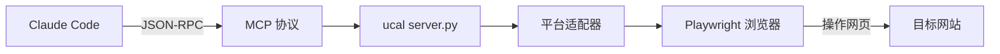

### 1.2 ucal 的痛点

通过实际对比测试（详见 `tests/benchmark_results.md`），暴露了以下问题：

#### 痛点 1: MCP 返回截断
ucal 的 `platform_read` 返回结构化 JSON（title + content + author），经 MCP 协议传输时超过 token 上限被截断。实测飞书文章 12,498 字符的页面，ucal 返回被 `(truncated)` 截断，而 browser-use 通过 stdout 完整返回。

**根因**: MCP 协议的响应大小有限制，而 CLI stdout 没有。

#### 痛点 2: 每次调用的启动开销
ucal 没有 daemon 架构，每次 MCP 调用都需要：建立 browser context → 加载 cookie → 执行操作 → 返回结果。对比 browser-use 的 daemon 模式（~50ms/命令），ucal 首次调用需要数秒。

#### 痛点 3: 无状态感知
ucal 没有 `state` 命令，agent 无法"看到"页面上有哪些可交互元素。只能依赖 CSS selector（需要预知 DOM 结构）或截图（费 token）。对比 browser-use 的 `state` 返回带索引的元素列表，交互更直观。

#### 痛点 4: Promise/async 限制
ucal 的 `eval_js` 支持 Promise（观察者模式可用），但 MCP 调用整体有超时限制。Grok 搜索等长时间操作（30-60 秒）容易触发 `AbortError`。

#### 痛点 5: CLI 不可组合
MCP 工具无法像 CLI 一样用管道组合：`anyweb read URL | jq .content > output.md`。

### 1.3 browser-use 对比

browser-use 是一个 CLI-first 的浏览器自动化工具，核心架构：

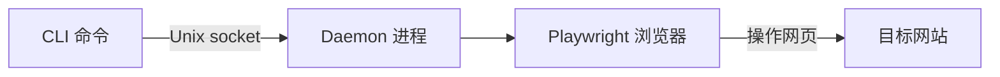

**browser-use 优势（ucal 缺失的）**:

| 能力 | 说明 |
|------|------|
| Daemon 架构 | 后台常驻，~50ms 命令延迟 |
| `state` 命令 | 返回页面可交互元素 + 索引号 |
| 命名 Session | `--session work` 多会话隔离 |
| `get` 命令族 | `get title/html/text/value/attributes/bbox` |
| `wait` 命令 | `wait selector/text` 等待元素出现/消失 |
| `cookies` 管理 | `cookies get/set/clear/import/export` |
| `hover/dblclick/rightclick` | 丰富的交互原语 |
| `python` 持久会话 | 跨命令共享变量 |
| `--headed` 模式 | 随时切换有头/无头 |
| Profile 支持 | `--profile` 使用系统 Chrome 已有登录态 |
| 无输出限制 | stdout 直出，不经 MCP 截断 |

**browser-use 劣势（ucal 的差异化优势）**:

| 能力 | ucal 有 | browser-use 无 |
|------|---------|---------------|
| 平台适配器 | x/zhihu/xhs 专用逻辑 | 无，纯通用操作 |
| 反检测 | 自研 stealth + anti_detect | 基础 stealth，知乎/X 未登录被拦 |
| 网络拦截 | pattern 匹配 XHR/fetch | 不支持 |
| 智能提取 | 一个 URL 自动识别平台、展开折叠、返回结构化数据 | 需手动 state→click→eval 多步操作 |
| Cookie 自动管理 | 按平台隔离 context + 自动加载 | 手动 import/export |
| `eval` Promise 支持 | 完整支持（观察者模式） | Promise 返回 `{}`（空对象） |

---

## 2. 核心概念科普

> 以下概念贯穿整个文档，理解它们有助于跟上后续的设计讨论。

### 2.1 什么是 DOM？—— 网页的"骨架"

打开一个网页，你看到的是文字、图片、按钮。但浏览器在幕后把整个页面解析成一棵**树形结构**，叫做 **DOM（Document Object Model，文档对象模型）**。

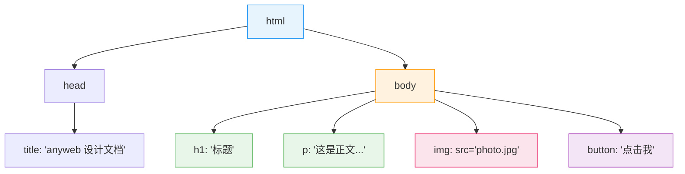

**类比**: 如果网页是一栋房子，DOM 就是这栋房子的**建筑图纸**。图纸里标注了每个房间（元素）的位置和内容，即使你站在一楼（屏幕可见区域），图纸上仍然写着三楼的房间信息。

**关键点**: DOM 是完整的数据结构，存在于浏览器内存中。它和你"看到"多少无关——就像一份 Word 文档有 100 页，即使你只看到第 1 页，文件中第 100 页的文字照样存在。

### 2.2 为什么不滑动页面就能提取全部文字？

很多人直觉认为"要看到内容才能提取"，这是一个常见误解。

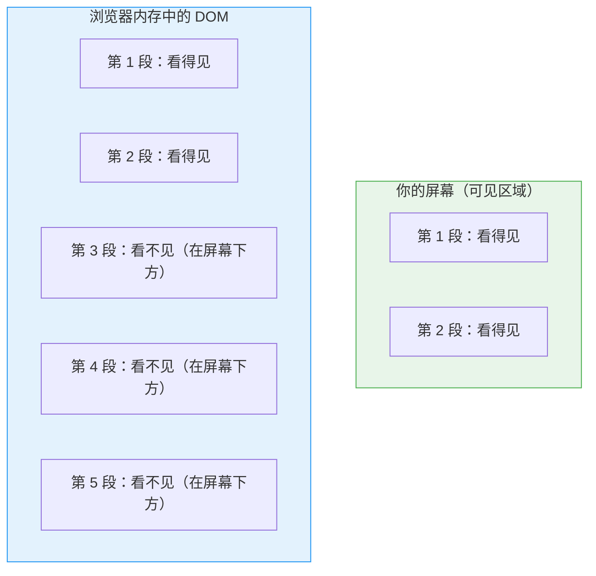

当我们执行 `document.body.innerText`（一行 JavaScript 代码），它读取的是 **DOM 树中的全部文字**，不是屏幕上的。就像你用"全选→复制"操作一个 Word 文档——不管文档多长，一次就能复制全部内容。

**实测验证**: 飞书一篇文章页面高达 22 屏（20,899 像素），不滚动直接执行 `innerText` 得到 12,498 字符；滚动到底再执行，还是 12,498 字符。**完全相同**。

**那什么时候必须滚动？** —— 当页面使用了**懒加载**（见 2.5 节）。

### 2.3 Headless 模式 vs Headed 模式 —— 浏览器的"隐身斗篷"

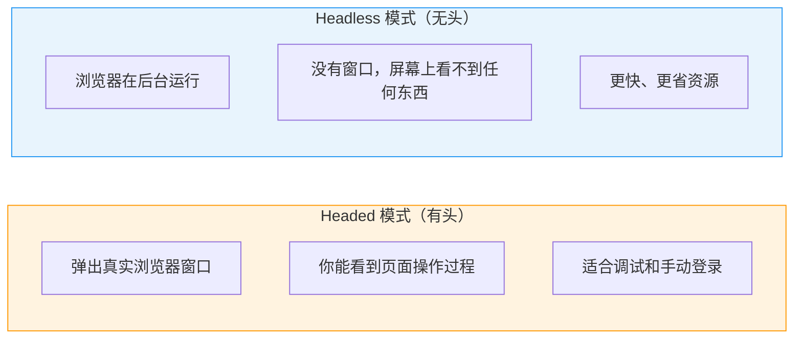

| | Headed（有头） | Headless（无头） |
|---|---|---|
| 有没有窗口 | 有，能看到浏览器在操作 | 没有，全程后台运行 |
| 速度 | 稍慢（需要渲染画面） | 更快（不用画画面） |
| 适合场景 | 调试、手动登录、看效果 | 自动化任务、服务器部署 |
| 类比 | 开着电视看节目 | 电视关了但录像机在录 |

**核心问题**: "无头模式能模拟人的操作吗？"

**能**。Headless 模式下浏览器功能完全一样——JavaScript 执行、Cookie 存储、DOM 操作、网络请求——唯一的区别是不渲染画面到屏幕上。点击按钮、输入文字、滚动页面，这些操作在无头模式下照常工作。

**但有一个坑**: 很多网站（知乎、X/Twitter）会检测浏览器是否是自动化工具。Headless 模式有一些"指纹"可以被检测到（比如 `navigator.webdriver` 标志位）。这就是为什么 anyweb 需要**反检测**模块——它在 headless 模式下伪装成正常浏览器。

### 2.4 网页中的图片 —— 为什么提取文字拿不到图片？

`document.body.innerText` 只返回**文字**。图片不是文字，所以不会出现在结果中。

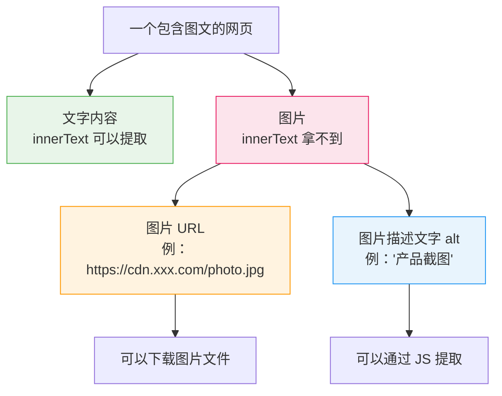

**anyweb 怎么处理图片？**

| 方法 | 说明 | 适合场景 |
|------|------|---------|
| 提取 `alt` 属性 | 图片标签上的描述文字，如 `` | 知道"这里有张图" |
| 提取 `src` URL | 图片的下载地址 | 需要下载或引用图片 |
| 截图 `screenshot` | 整个页面或某个区域的截图 | 需要"看到"页面完整样貌 |
| 多模态理解 | Claude Code 可以直接看截图，理解图片内容 | 需要理解图中信息 |

**`read` 命令的默认行为**: 返回文字内容 + 图片 URL 列表。如果加 `--markdown` 参数，图片会以 `` 格式嵌入 Markdown。

### 2.5 懒加载 —— 为什么有些页面必须滚动才能采全？

懒加载（Lazy Loading）是一种优化技术：**只加载你看到的部分，滚动到哪里才加载哪里**。

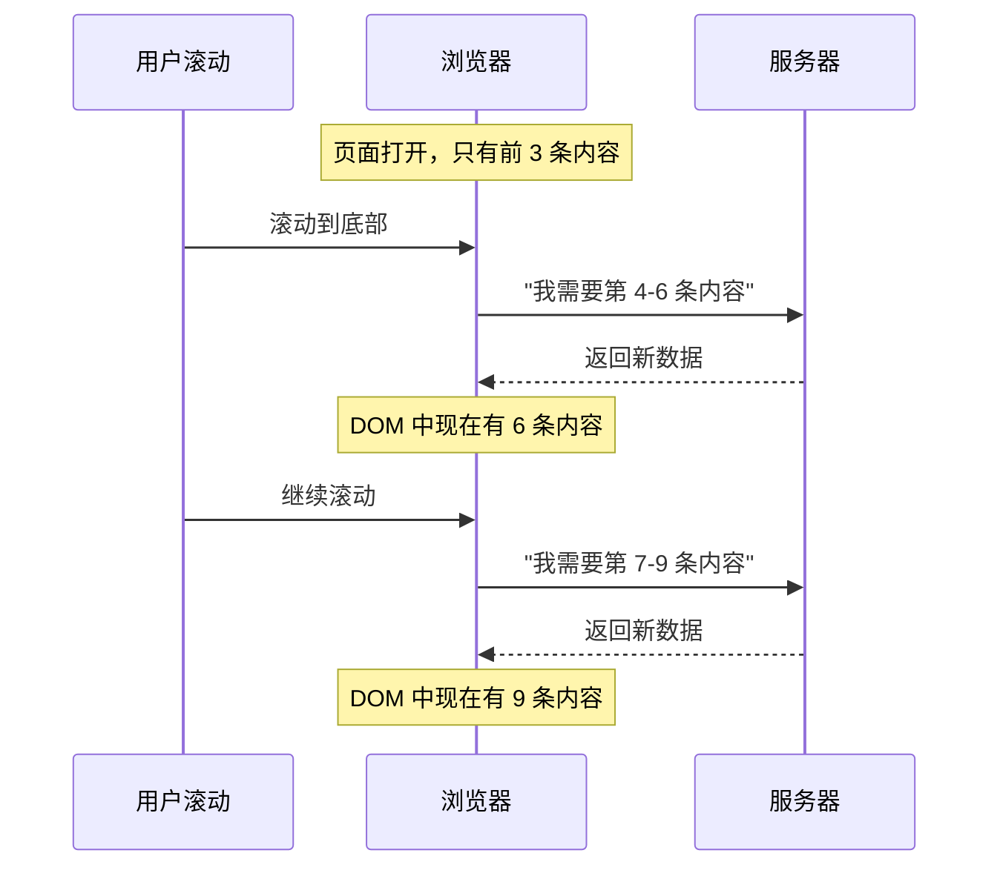

**类比**: 就像餐厅的无限续杯——你喝完一杯，服务员才倒下一杯。如果你不喝（不滚动），服务员不会来（内容不会加载）。

**哪些页面用了懒加载？**

| 页面类型 | 是否懒加载 | 影响 |
|----------|-----------|------|
| 飞书文章 | 否 | 打开即全部加载，不用滚动 |
| 知乎长回答 | 部分是 | "显示全部"按钮后面的内容需要点击展开 |
| 小红书信息流 | 是 | 下方内容需要滚动触发加载 |
| X/Twitter 时间线 | 是 | 旧推文需要不断滚动加载 |
| 普通博客文章 | 通常否 | 打开即全部加载 |

**anyweb 怎么处理懒加载？**

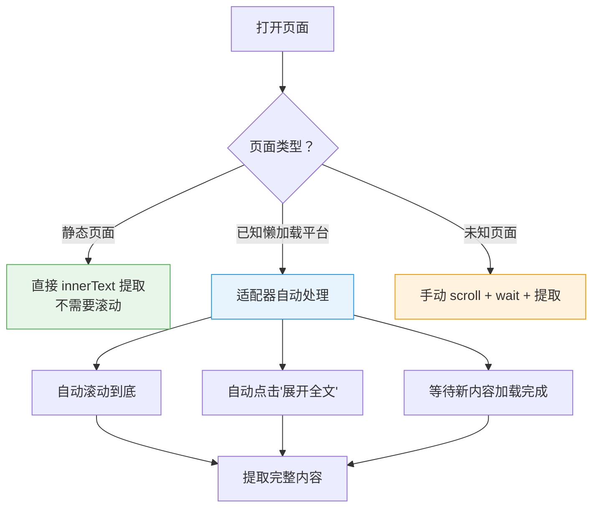

对于 `read` 命令：适配器知道每个平台的懒加载规则，自动处理。对于原子命令：用户需要自己 `scroll down` → `wait` → `eval` 循环操作。

### 2.6 反检测 —— 为什么自动化浏览器会被网站识别？

网站不喜欢机器人访问（怕被爬取数据），所以会检测你是不是真人。自动化浏览器（Playwright/Selenium）会留下很多"指纹"：

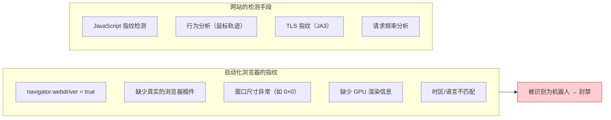

**anyweb 的反检测策略**：

| 层级 | 做什么 | 目的 |
|------|--------|------|
| Stealth 脚本 | 覆盖 `navigator.webdriver`、注入假插件列表 | 骗过 JavaScript 指纹检测 |
| Anti-detect 脚本 | 模拟真实的 WebGL、Canvas 渲染信息 | 骗过高级指纹系统 |
| 人类行为模拟 | 随机鼠标移动、打字速度波动、随机延迟 | 骗过行为分析 |
| Cookie 持久化 | 保存登录态，下次自动加载 | 像一个"回头客"而非新访客 |

**实测效果**: ucal 的反检测可以让自动化浏览器免登录访问知乎和 X/Twitter；browser-use 的基础 stealth 不够，未登录时直接被拦截。

---

## 3. anyweb 设计

### 3.1 定位

**anyweb** = browser-use 的 CLI 体验 + ucal 的平台智能

- 不是"又一个 browser-use"——差异化在于「给一个 URL 就能智能处理」
- 不是"ucal 换壳"——解决 MCP 截断、无 daemon、无状态感知等痛点
- CLI 是主入口，MCP 作为兼容层保留

### 3.2 架构

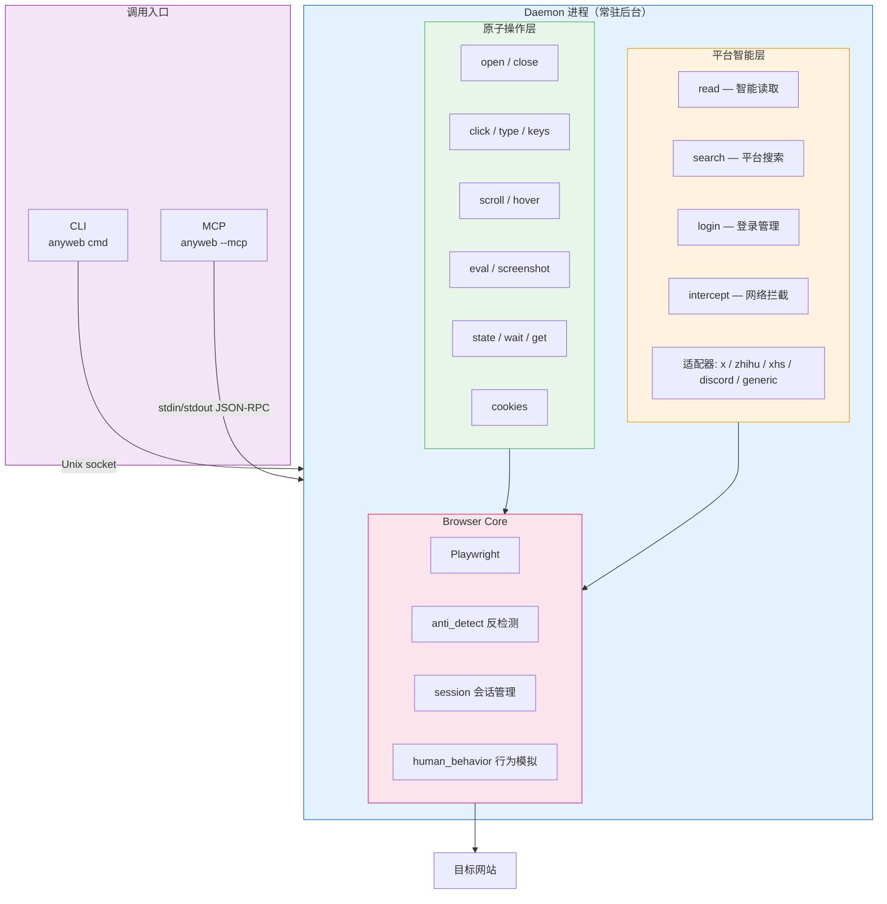

**文件布局**:
```
~/.anyweb/
├── config.json          # 配置（headless、平台选项等）
├── sessions/            # Cookie 持久化（按平台）
│   ├── x.json
│   ├── zhihu.json
│   └── xhs.json
├── default.sock         # Daemon Unix socket
├── default.pid          # Daemon PID
└── daemon.log           # 日志
```

### 3.3 命令体系

#### 原子操作层（对标 browser-use）

| 命令 | 说明 | 示例 |
|------|------|------|
| `open <url>` | 导航到 URL | `anyweb open https://x.com` |
| `state` | 返回页面元素索引 | `anyweb state` |
| `click <idx\|selector>` | 点击（索引号或 CSS selector 自动识别） | `anyweb click 5` / `anyweb click "button.submit"` |
| `type "text"` | 在当前焦点元素输入 | `anyweb type "hello"` |
| `input <idx> "text"` | 点击元素后输入 | `anyweb input 3 "query"` |
| `keys "combo"` | 发送键盘事件 | `anyweb keys "Enter"` / `anyweb keys "Control+a"` |
| `scroll <dir>` | 滚动页面 | `anyweb scroll down --amount 1000` |
| `eval "js"` | 执行 JavaScript（支持 Promise） | `anyweb eval "document.title"` |
| `screenshot [path]` | 截图 | `anyweb screenshot page.png` |
| `wait` | 等待元素/文本/页面稳定 | `anyweb wait selector "h1"` / `anyweb wait stable` |
| `get` | 信息获取 | `anyweb get title/html/text/value` |
| `hover/dblclick/rightclick` | 扩展交互 | `anyweb hover 5` |
| `back` | 后退 | `anyweb back` |
| `cookies` | Cookie 管理 | `anyweb cookies get/set/import/export` |
| `close` | 关闭浏览器 | `anyweb close` |
| `sessions` | 列出活跃会话 | `anyweb sessions` |

#### 平台智能层（ucal 独有）

| 命令 | 说明 | 示例 |
|------|------|------|
| `read <url>` | 智能读取：自动识别平台 → 反检测 → 展开折叠 → 结构化输出 | `anyweb read https://x.com/karpathy` |
| `search <platform> "query"` | 平台内搜索 | `anyweb search zhihu "AI agent"` |
| `login <platform>` | 登录并保存 session | `anyweb login x` |
| `intercept <url> --pattern "api/"` | 带网络拦截的页面访问 | `anyweb intercept https://feishu.cn/... --pattern "api/"` |

#### 全局选项

| 选项 | 说明 |
|------|------|
| `--session <name>` | 命名会话（默认 "default"） |
| `--headed` | 显示浏览器窗口 |
| `--json` | JSON 格式输出 |
| `--mcp` | 作为 MCP server 运行 |

### 3.4 `read` 命令详解 — 杀手级能力

`read` 是 anyweb 与 browser-use 的核心差异。一个命令完成 browser-use 需要 5-10 步的工作：

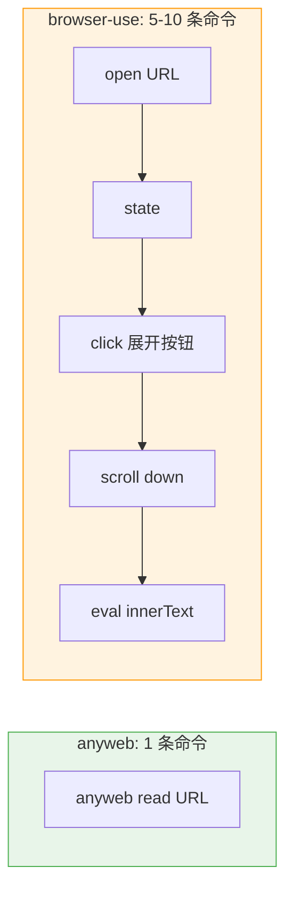

**`read` 内部做了什么？**

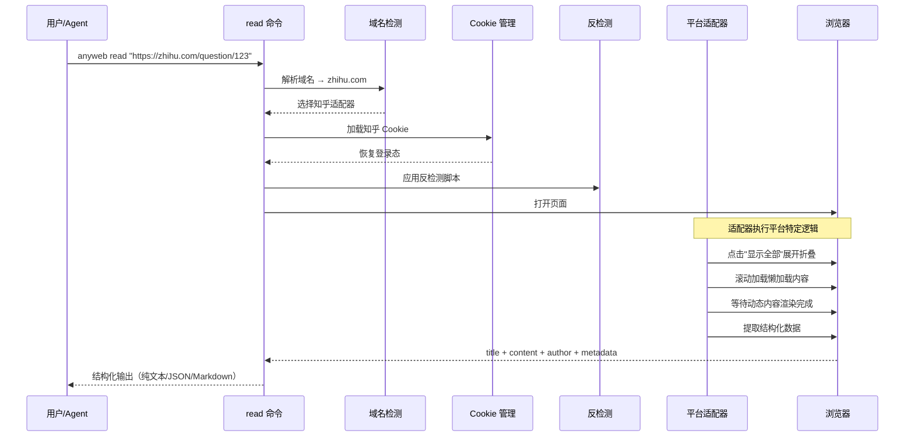

输出格式：
```bash
# 默认: 纯文本（方便管道）
anyweb read "https://x.com/karpathy" | head -20

# --json: 结构化 JSON
anyweb read "https://x.com/karpathy" --json | jq .content

# --markdown: Markdown 格式（图片以  嵌入）
anyweb read "https://x.com/karpathy" --markdown > output.md
```

### 3.5 Daemon 架构 — 为什么需要常驻后台进程？

**问题**: 每次执行命令都要启动浏览器（~3 秒）→ 操作 → 关闭浏览器。如果你要连续执行 10 个命令，就要启动关闭 10 次浏览器。

**解决**: 浏览器在后台一直开着（daemon），命令只是"发指令"过去，~50ms 就能得到结果。

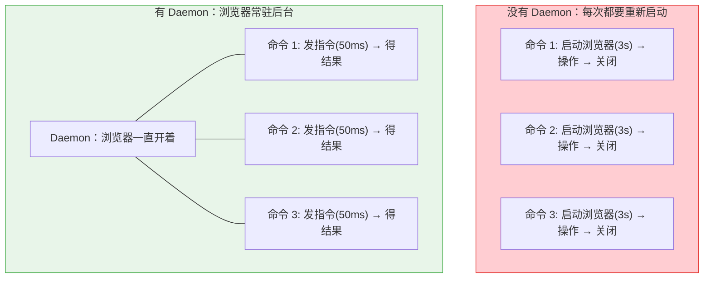

**Daemon 生命周期**:

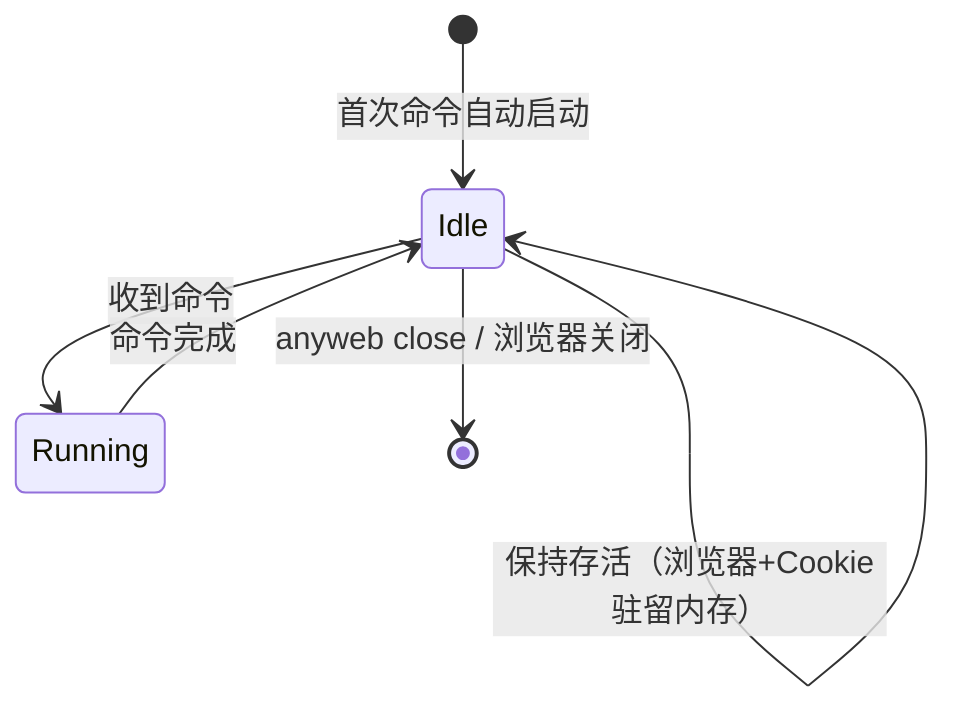

**多会话支持**:
```bash
anyweb --session work open https://x.com      # 工作会话
anyweb --session personal open https://zhihu.com  # 个人会话
# → 每个 session 独立的 daemon + socket + browser
```

---

## 4. 关键问题与解决方案

### 4.1 页面内容完整性总览

不同类型的页面需要不同的提取策略。下图总结了判断流程：

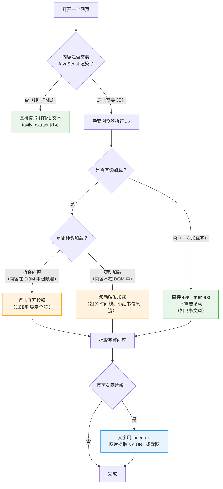

实测数据（飞书文章页）：
- 页面 22 屏高（20,899px），不滚动 `innerText` = 12,498 字符
- 滚动到底后 = 12,498 字符（相同，无懒加载）
- **browser-use 和 ucal 采集量一致**，差异仅在传输层（MCP 截断 vs stdout 完整）

### 4.2 自主导航能力 — "agent 如何学会操作新网站？"

**现实**: 不存在一个工具能自动学会所有网站的交互逻辑。解决方案是**三层智能分工**：

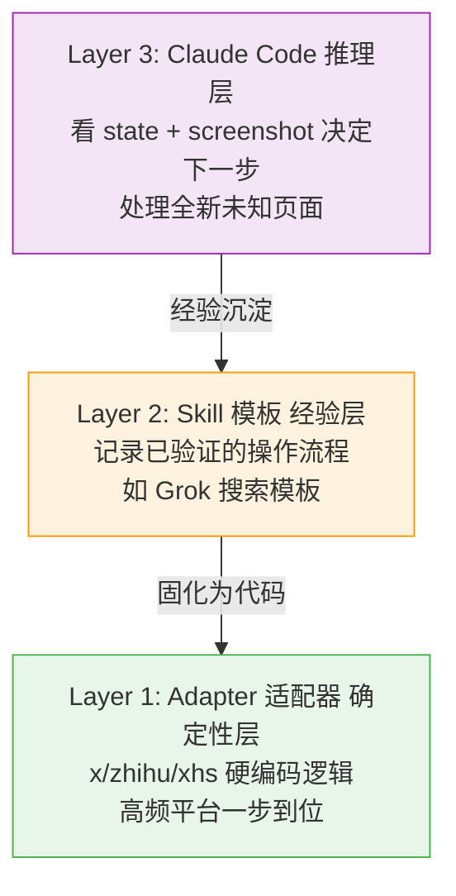

**类比**: 就像人学习开车——

- **第 1 层（适配器）** = 肌肉记忆。你每天开的那条路，闭着眼都能开。（知乎、X 等高频平台）
- **第 2 层（Skill 模板）** = 驾驶经验。看到红绿灯知道怎么反应，虽然不是这条路专属的。（Grok 搜索模板、评论区展开流程）
- **第 3 层（Claude Code）** = 大脑判断。到了一个完全陌生的城市，看路标、看地图、做决策。（`state` 看页面元素，`screenshot` 看页面长什么样）

**anyweb 提供感知工具，Claude Code + Skill 提供智能**：

- `state` — 文本感知：页面有哪些可交互元素（按钮、链接、输入框）
- `screenshot` — 视觉感知：Claude Code 是多模态的，可以直接看截图理解页面
- `read` — 平台智能：已知平台一步到位
- Skill — 经验复用：把成功的操作流程模板化，下次直接套用

**与 browser-use `run` 的区别**: browser-use 的 `run` 调用另一个 LLM agent 做自主导航。anyweb 不需要——Claude Code 本身就是 agent，只需要给它足够的感知工具（state + screenshot）和经验（skill + adapter）。

### 4.3 观察者模式 — "如何等待不确定时间的异步内容？"

有些操作的完成时间不可预知。比如 Grok 生成回复可能需要 20 秒也可能需要 60 秒。固定等待（`sleep 50`）要么等太久浪费时间，要么等不够拿不到完整结果。

**观察者模式**: 不断检查页面内容是否还在变化，连续几次没变化就判定"完成了"。

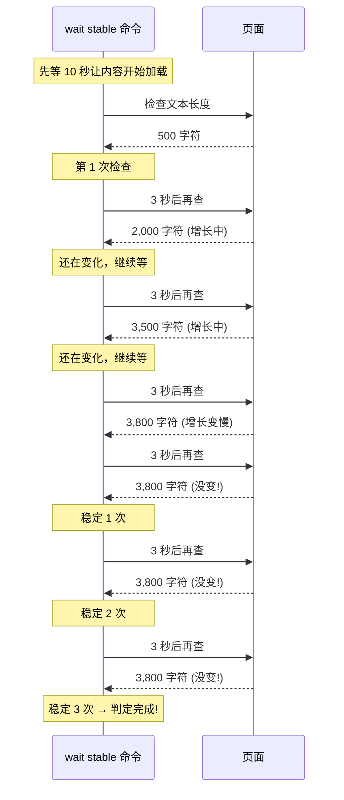

**anyweb 的 `wait stable` 命令**：

```bash
# 等待页面稳定（观察者模式内置化）
anyweb wait stable --timeout 60000 --threshold 3
# 含义: 页面文本长度连续 3 次检测无变化则判定稳定
# 超过 60 秒兜底超时
```

将观察者模式从 eval_js 中的临时代码提升为一等命令，不再需要 Claude Code 写复杂的 Promise 轮询逻辑。

### 4.4 网络拦截 — "如何拿到页面背后的 API 数据？"

你看到的网页内容，很多是浏览器从服务器的 API 拿到后渲染出来的。网络拦截就是在浏览器和服务器之间"窃听"这些 API 通信。

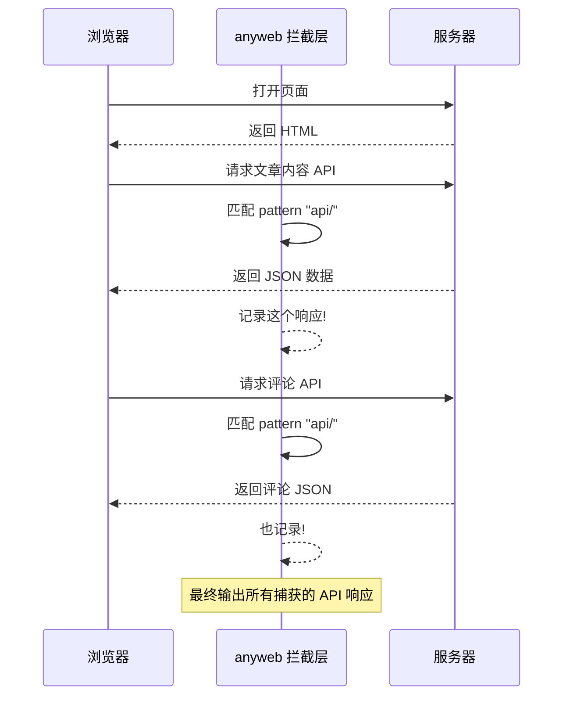

**为什么有用？** API 返回的是干净的结构化 JSON 数据，比从 DOM 提取的文字更精确、更完整。比如飞书文章页面，通过网络拦截可以直接拿到文章分类、访客追踪、子分类等 10 个 API 的原始数据（1.9M 字符），这些信息在页面上根本看不到。

---

## 5. 从 ucal 到 anyweb 的迁移

### 5.1 代码复用

| ucal 模块 | anyweb 去向 | 改动 |
|-----------|------------|------|
| `core/browser.py` | `core/browser.py` | 改造为 daemon 模式 |
| `core/anti_detect.py` | `core/anti_detect.py` | 直接复用 |
| `core/session.py` | `core/session.py` | 路径改为 `~/.anyweb/sessions/` |
| `utils/human_behavior.py` | `core/human_behavior.py` | 直接复用 |
| `adapters/*.py` | `adapters/*.py` | 直接复用 |
| `server.py` | `mcp.py` (薄层) | MCP 兼容层，调用 daemon |
| — (新增) | `cli.py` | CLI 入口 + argparse |
| — (新增) | `daemon.py` | Daemon 进程 + socket 通信 |
| — (新增) | `state.py` | 页面状态提取 + 元素索引 |

### 5.2 项目结构

```
anyweb/
├── pyproject.toml
├── src/anyweb/
│   ├── __init__.py
│   ├── cli.py              # CLI 入口（argparse）
│   ├── daemon.py            # Daemon 进程管理 + socket 通信
│   ├── mcp.py               # MCP server 兼容层
│   ├── core/
│   │   ├── browser.py       # Playwright 管理（从 ucal 迁移）
│   │   ├── anti_detect.py   # 反检测（从 ucal 迁移）
│   │   ├── session.py       # Cookie 管理（从 ucal 迁移）
│   │   ├── human_behavior.py # 人类行为模拟（从 ucal 迁移）
│   │   └── state.py         # 页面状态提取 + 元素索引（新增）
│   └── adapters/
│       ├── base.py          # 适配器基类（从 ucal 迁移）
│       ├── generic.py       # 通用适配器（从 ucal 迁移）
│       ├── twitter.py       # X/Twitter 适配器（从 ucal 迁移）
│       ├── zhihu.py         # 知乎适配器（从 ucal 迁移）
│       ├── xhs.py           # 小红书适配器（从 ucal 迁移）
│       └── discord_api.py   # Discord 适配器（从 ucal 迁移）
├── config/
│   └── default.json         # 默认配置模板
└── tests/
    └── ...
```

### 5.3 实施阶段

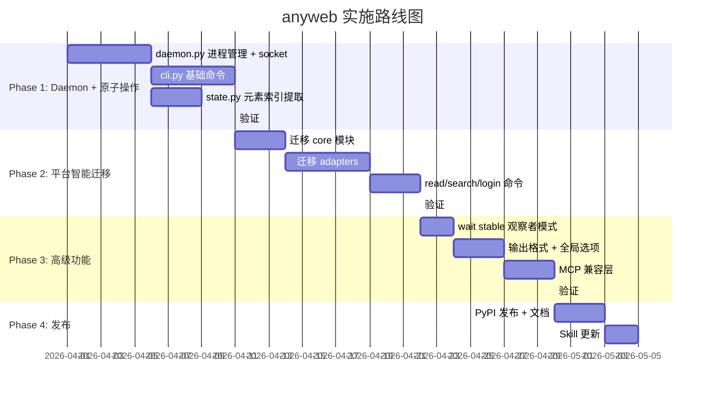

**Phase 1: Daemon + 原子操作** (核心基础)
- daemon.py: 进程管理、socket 通信、session 隔离
- cli.py: `open`, `close`, `sessions`, `eval`, `screenshot`
- state.py: 页面元素索引提取
- cli.py: `state`, `click`, `type`, `input`, `keys`, `scroll`, `wait`, `get`
- 验证: daemon 延迟 < 100ms，`state` 返回正确元素索引

**Phase 2: 平台智能迁移**
- 迁移 core/: browser.py, anti_detect.py, session.py, human_behavior.py
- 迁移 adapters/: 全部 5 个适配器
- cli.py: `read`, `search`, `login`, `intercept`
- `cookies` 命令族
- 验证: `anyweb read` 对标 `ucal platform_read` 输出一致

**Phase 3: 高级功能**
- `wait stable` 观察者模式命令
- `--json` / `--markdown` 输出格式
- `--headed` / `--session` 全局选项
- MCP 兼容层 (`anyweb --mcp`)
- `anyweb doctor` / `anyweb install`
- 验证: MCP 模式可替代原 ucal server

**Phase 4: 发布**
- PyPI 发布: `pip install anyweb` / `uvx anyweb`
- Claude Code skill 更新: x-feed 等 skill 改用 anyweb CLI
- 文档: README + 命令参考

---

## 6. 成功标准

| 指标 | 目标 |
|------|------|
| 命令延迟 | daemon 模式 < 100ms（对标 browser-use ~50ms） |
| `read` 完整度 | 输出不截断，等于或优于 browser-use eval 的完整性 |
| 反检测通过率 | X/知乎/小红书未登录可访问（对标 ucal 现有能力） |
| 调用效率 | 日报场景 `read` 比手动 state→click→eval 减少 60% 调用 |
| 兼容性 | MCP 模式可无缝替代 ucal |
| 安装体验 | `uvx anyweb open https://example.com` 一条命令可用 |

---

## 7. 附录: 对比测试数据摘要

详见 `tests/benchmark_results.md`，关键数据：

| 测试 | ucal | browser-use | anyweb 预期 |
|------|------|-------------|------------|
| 飞书文章读取 | 15.9s/1次/被截断 | 9.7s/2次/完整 | <5s/1次/完整 |
| Grok 搜索 | 48.4s/1次 | 44.8s/6次 | ~45s/1次(wait stable) |
| 知乎读取 | 36.5s/3次/OK | 28.5s/6次/需手动登录 | <15s/1次/OK |
| 网络拦截 | 21.5s/OK | 不支持 | <10s/OK |
| 日报全流程 | ~12次调用 | ~30次调用 | ~10次调用 |

---

## 8. 术语表

| 术语 | 解释 |
|------|------|
| **DOM** | Document Object Model，浏览器把网页解析成的树形数据结构，包含页面所有元素 |
| **innerText** | JavaScript 属性，获取 DOM 中所有可见文字内容 |
| **Headless** | 无头模式，浏览器在后台运行，不显示窗口 |
| **Daemon** | 常驻后台的进程，避免每次命令都重新启动浏览器 |
| **Lazy Loading** | 懒加载，页面只加载当前可见区域的内容，滚动时才加载更多 |
| **Cookie** | 浏览器存储的小文件，记录登录状态等信息 |
| **Anti-detect** | 反检测，伪装自动化浏览器使其看起来像正常用户 |
| **Stealth** | 隐身脚本，覆盖浏览器的自动化标识 |
| **MCP** | Model Context Protocol，Claude Code 与外部工具通信的协议 |
| **Playwright** | 微软开源的浏览器自动化框架，支持 Chromium/Firefox/WebKit |
| **Unix Socket** | 同一台机器上两个进程之间的通信通道，比网络请求更快 |
| **CSS Selector** | 用来定位网页元素的表达式，如 `button.submit` 表示 class 为 submit 的按钮 |
| **XHR/fetch** | 浏览器在后台向服务器发送请求的方式（不刷新页面） |
| **Promise** | JavaScript 中处理异步操作的机制，"承诺将来会给你一个结果" |
